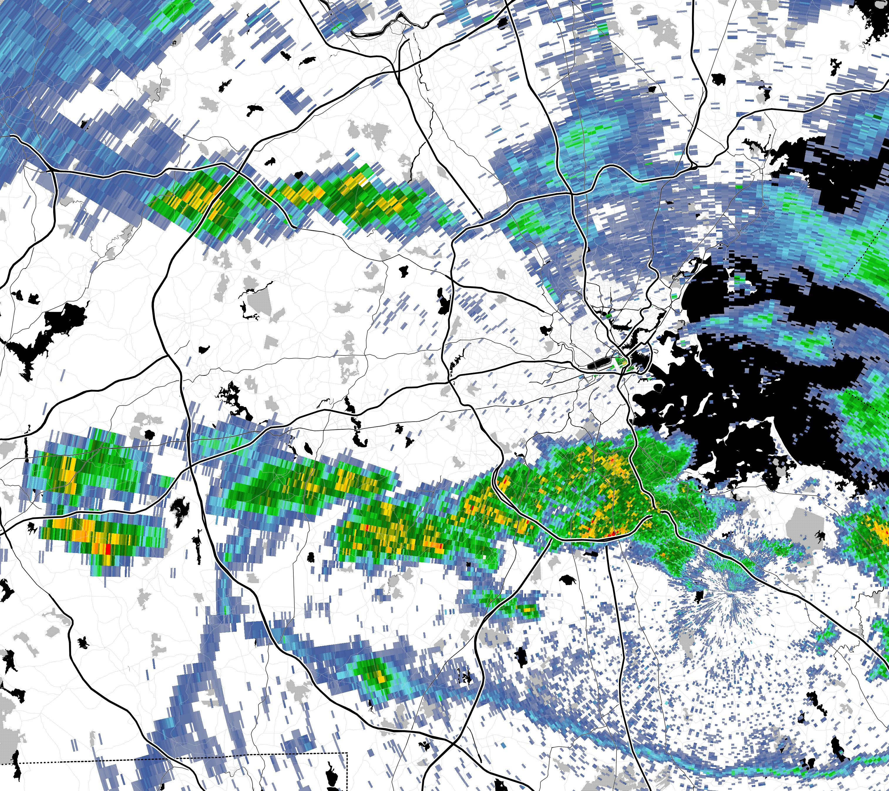

# Mr. Radar

Mr. Radar is a minimalist Python application for rendering radar data
from the National Weather Service of the United States. Radar data is
rendered using the standard NWS color scale and saved in png format.
An HTML page is generated which layers the radar images with
user-specified map layers and displays the radar images in an animated
loop.

### Usage

Fill out the `config.ini` file with your desired radar layer(s), map
layers, and latitude/longitude extents.  Then call `mr_radar.py`
periodically (or pass the `--repeat` flag with a refresh interval in
seconds).  The png files with radar data and html file of the
animation will be placed in named folders corresponding to the radar
layer names in the configuration file.

The `make_map.py`, `level3_to_png.py`, and `generate_html.py` files
are also callable as standalone utilities.  `make_map.py` downloads
and stitches together map tiles to generate a png map image.
`level3_to_png.py` renders a "level 3" radar data file to a png image
over the specified extents.  `generate_html.py` creates an HTML radar
animation with the png images that are present in a specified directory.

### Radar data

Raw radar files are downloaded from the National Weather Service
[FTP server](https://www.weather.gov/tg/radfiles).
It can be helpful to explore the
[directory browser](https://tgftp.nws.noaa.gov/SL.us008001/DF.of/DC.radar/)
to identify the path for your desired radar site and product.
The most recent radar file in each directory is named `sn.last`.

Currently, Mr. Radar only supports base reflectivity products
(e.g. product codes `p19r0` and `180z0`).  Composite products use a
rectangular pixel grid (instead of the polar pixel grid which we
assume), and non-reflectivity products require different colormaps.
It should not be too difficult to add support for these products in a
future release.

More information about radar file formats and data processing is
available on my [website](http://dlaw.me/weather-radar/).

### Map data

Map data and radar data are rendered using a
[web Mercator](https://en.wikipedia.org/wiki/Web_Mercator_projection)
projection.  As such, map data can be downoaded from nearly any
online map service using the standard
["slippy" tile format](https://wiki.openstreetmap.org/wiki/Slippy_map_tilenames),
including any of the
[tile servers](https://wiki.openstreetmap.org/wiki/Tile_servers)
listed by OpenStreetMap.

A base map layer is rendered beneath the radar data, and an overlay
map layer is rendered above the radar data.  If the overlay map layer
is used, it must be mostly transparent in order to avoid obscuring the
radar data.  The [toner-lines](http://maps.stamen.com/toner-lines/)
tiles from Stamen Design work exceptionally well.  (The problem with
only rendering map data beneath radar data is that you can't see the
map at all when there is a big storm.)

Map tiles are automatically fetched and stitched together into a
single png image on the first call to `mr_radar.py`.  The latitude and
longitude extents of the png image are stored in the png metadata. The
cached map image is *not* automatically refreshed when the URL or
extents are changed; remove `base_map.png` and `overlay_map.png` from
the output directory whenever it is necessary to regenerate the map.

Note: Since stamen maps were migrated to stadia maps, you now need an API key to access map tiles. It's free to generate one for server use, just [create an account](https://client.stadiamaps.com/signup/?utm_source=stamen), make a property, and create an API key. Just copy the key into [`config.ini`](/config.ini#L10), replacing `YOUR_STADIAMAPS_API_KEY`, and it should work!

### Dependencies

* Python 3
* [MetPy](https://unidata.github.io/MetPy/latest/index.html)
* [pyproj](https://pyproj4.github.io/pyproj/stable/)
* [NumPy](https://numpy.org/)
* [matplotlib](https://matplotlib.org/)
* [Pillow](https://pillow.readthedocs.io/en/stable/)
* [Jinja](https://jinja.palletsprojects.com/)

### Future work

* Improve the HTML page with a UI to control animation speed.
* Performance profiling and improvements.
* Support for additional radar products (composite reflectivity,
  radial velocity, etc).
* Better packaging of Python files.
